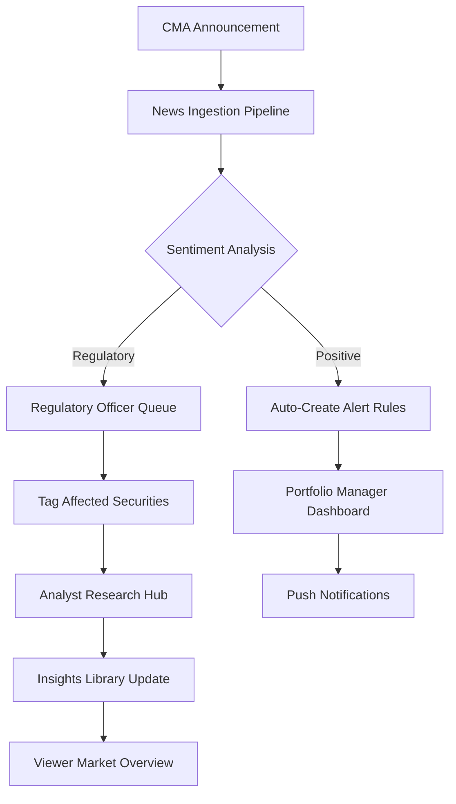

# Nairobi Stock Exchange Change Tracker (NSE‑CT) — System Design Brief

## 1. System Overview

The Nairobi Stock Exchange Change Tracker (NSE‑CT) is a SaaS application that ingests real‑time market data, regulatory announcements, corporate actions, and macro‑economic news. It stores the data in a time‑series database, applies analytics, and surfaces the information through dashboards, alerts, and reporting tools. Built upon an existing OSINT platform with news processing, user management, and analytics capabilities, NSE‑CT extends this foundation with specialized market tracking features tailored to the NSE ecosystem.

---

## 2. User Functions (Roles & Core Capabilities)

### 2.1 Viewer / Market Watcher

**Primary Purpose:** Consume up‑to‑date market information without editing any data.

**Key Functions:**
- Browse live ticker and price charts
- Filter by sector, market cap, or date range
- Export snapshots (CSV/PNG)
- View sector heatmaps and market overview dashboards
- Subscribe to news feeds for specific companies or sectors

**Typical Workflow:**
1. Log in to the platform
2. Open "Market Overview" dashboard
3. Apply a filter for "Technology" sector
4. View trending companies and recent news
5. Export chart as PNG for a presentation

---

### 2.2 Portfolio Manager

**Primary Purpose:** Track holdings against NSE movements and receive tailored alerts.

**Key Functions:**
- Build and maintain portfolios of NSE‑listed securities
- Set price‑threshold or percentage‑change alerts
- View portfolio performance versus NSE‑All Share Index
- Generate periodic P&L reports
- Receive push notifications when alert triggers fire

**Typical Workflow:**
1. Add "Safaricom Ltd (SCOM)" to portfolio
2. Set an alert for a 5% drop below current price
3. Configure notification preferences (push, email, in-app)
4. Receive push notification when trigger fires
5. Review impact on portfolio performance dashboard
6. Generate weekly P&L report for stakeholder review

---

### 2.3 Analyst / Researcher

**Primary Purpose:** Perform deeper analyses, generate insights, and share reports.

**Key Functions:**
- Access historical corporate action logs (dividends, splits, rights issues)
- Run custom queries (e.g., "All stocks that increased >10% after a dividend announcement")
- Create and share interactive notebooks or PDF reports
- Comment on data points for peer review
- Tag companies or news articles with research notes

**Typical Workflow:**
1. Query "All energy sector stocks with price spikes >8% in the last 30 days"
2. Filter results by market cap threshold
3. Export results to an R notebook for further analysis
4. Create a research report with visualizations
5. Publish findings to the internal "Insights Hub"
6. Tag relevant companies with research notes for other users

---

### 2.4 Regulatory Officer

**Primary Purpose:** Monitor compliance‑related announcements and ensure data integrity.

**Key Functions:**
- Review and approve inbound regulatory feeds (Capital Markets Authority releases, listing requirements)
- Flag inconsistent or erroneous corporate actions
- Generate compliance audit trails
- Tag regulatory announcements with affected securities

**Typical Workflow:**
1. Receive notification of new "Listing Rule Change" notice from CMA
2. Review the announcement in the regulatory feed queue
3. Approve the feed for ingestion into the system
4. Tag affected securities (e.g., FinTech Africa Ltd, M-Pay Holdings)
5. Add notes for analysts and portfolio managers
6. Generate compliance audit report for internal review

---

### 2.5 System Administrator

**Primary Purpose:** Manage users, security, and system health.

**Key Functions:**
- Create, modify, deactivate user accounts and role assignments
- Configure data‑source connections (Bloomberg, NSE API, news aggregators)
- Monitor system performance, error logs, and backup status
- Set organization‑wide notification policies
- Manage API keys and integration credentials

**Typical Workflow:**
1. Onboard a new analyst, assign "Analyst" role
2. Update the NSE API key after rotation
3. Review daily health dashboard for latency spikes
4. Configure a new news source integration
5. Audit user permissions and access logs

---

### 2.6 Developer / Integration Engineer

**Primary Purpose:** Extend the platform via APIs and custom widgets.

**Key Functions:**
- Access REST/GraphQL endpoints for market data, alerts, and portfolio actions
- Deploy custom visualizations using the SDK
- Write automated tests for data pipelines
- Build and publish custom widgets to the marketplace

**Typical Workflow:**
1. Review API documentation for market data endpoints
2. Build a custom widget that overlays macro‑economic indicators on price charts
3. Write unit tests for the new widget
4. Deploy to the "Marketplace" for other users
5. Monitor usage metrics and gather feedback

---

## 3. Reflective News — Real‑World Update in the Platform

### 📰 NSE NEWS FLASH — 08 Feb 2026

> *"Nairobi Stock Exchange posts a 3.2% gain in the All‑Share Index on Monday, driven primarily by a surge in technology and renewable‑energy stocks after the Capital Markets Authority (CMA) announced revised listing requirements that lower the minimum capital threshold for fintech companies."*

---

#### Key Take‑aways for NSE‑CT Users

**Portfolio Managers:**
- New alert rule automatically created for all fintech stocks
- Trigger: "Notify if price moves >4% within 2 trading days of CMA announcement"
- Dashboard updates to show fintech sector exposure

**Analysts / Researchers:**
- Pre‑built query "Fintech‑sector performance post‑CMA rule change" available in the "Insights Library"
- Historical data snapshot captured for before/after analysis
- Research notebook template generated for further investigation

**Regulatory Officers:**
- CMA press release imported automatically
- Flagged for review in the regulatory feed queue
- Attached to affected securities (e.g., FinTech Africa Ltd, M-Pay Holdings)
- Compliance note added: "Lower capital threshold may increase market participation"

**Viewers / Market Watchers:**
- "Market Overview" dashboard now shows a **Sector Heatmap** highlighting a 12% YoY growth in the Technology sector
- News ticker updated with the announcement
- Company profiles for fintech firms show "Regulatory Update" flag

**System Administrators:**
- News source (CMA) feed status: Active
- API rate limits monitored for increased query volume
- Performance dashboard shows no latency impact

---

#### How News Flows Through the System

---

## 4. Cross‑Role Interactions

| Interaction | From Role | To Role | Trigger | Action |
|-------------|-----------|---------|---------|--------|
| **Analyst tags data point** | Analyst | Portfolio Manager | Research note added to a company | PM receives notification; may adjust portfolio |
| **Regulator approves feed** | Regulatory Officer | All Users | CMA announcement approved | News appears on dashboards and tickers |
| **Alert triggered** | System | Portfolio Manager | Price threshold crossed | Push notification; redirect to portfolio view |
| **Widget published** | Developer | All Users | Custom visualization deployed | Available in marketplace; visible to all |
| **Report published** | Analyst | Viewer | Research shared | Added to Insights Library; appears in feeds |
| **User onboarding** | System Administrator | New User | Account created | Role‑specific dashboard rendered |

---

## 5. System Data Refresh & Update Mechanisms

### 5.1 Real‑Time Data Feeds
- **NSE Live Ticker:** WebSocket connection for sub‑second price updates
- **News Aggregator:** Polling every 5 minutes for new headlines
- **Regulatory Feeds:** Dedicated CMA API connection with push notifications

### 5.2 Scheduled Ingestion
- **Nightly Batch:** Historical data backfill and corporate action updates (02:00 EAT)
- **Weekly Reports:** Portfolio performance summaries generated every Sunday
- **Monthly Analytics:** Comprehensive sentiment and trend reports

### 5.3 Manual Interventions
- **Regulatory Approvals:** Human review required for CMA announcements before public release
- **Data Corrections:** Moderator role can flag and correct erroneous entries
- **Emergency Alerts:** System Administrator can broadcast urgent notifications

### 5.4 Data Quality Assurance
- **Content Hashing:** Deduplication of news articles using SHA‑256 hashes
- **Confidence Scoring:** Sentiment analysis includes confidence intervals
- **Audit Logging:** All data modifications logged with user ID and timestamp

---

## 6. Technical Foundation (Existing Codebase Integration)

The NSE‑CT platform builds upon the existing OSINT project with the following extensions:

### 6.1 Extended User Roles
The existing `User` entity (`backend/src/common/entities/user.entity.ts`) provides:
- `isAdmin` flag → Maps to System Administrator role
- `isModerator` flag → Extends to Regulatory Officer role
- **New roles to add:** Portfolio Manager, Analyst, Developer

### 6.2 Company Data Model
The `Company` entity (`backend/src/common/entities/company.entity.ts`) already supports:
- Stock tickers and sector classification
- Market cap tracking
- Listed date for historical analysis

**Extensions needed:**
- Add price history time‑series data
- Add portfolio holdings association
- Add regulatory flags and compliance status

### 6.3 News Processing Pipeline
The existing news service (`backend/src/news/news.service.ts`) provides:
- Article ingestion and deduplication
- Sentiment analysis with confidence scores
- Company mention linking

**Extensions needed:**
- Regulatory content classification
- Corporate action detection
- Real‑time news alerts

### 6.4 Analytics Platform
The analytics service (`backend/src/analytics/analytics.service.ts`) provides:
- Sentiment analytics and distribution
- Trending companies and events
- User engagement metrics

**Extensions needed:**
- Portfolio performance tracking
- Market index correlation
- Price volatility analytics

---

## 7. Implementation Priorities

### Phase 1: Core Platform (Weeks 1‑4)
- [ ] Extend user roles with Portfolio Manager and Analyst
- [ ] Implement NSE ticker data model and price history
- [ ] Build portfolio management CRUD operations
- [ ] Create basic market dashboard with sector heatmap

### Phase 2: Alerting & Notifications (Weeks 5‑8)
- [ ] Implement price‑threshold alert engine
- [ ] Build notification delivery system (push, email, in‑app)
- [ ] Create alert management UI
- [ ] Integrate with existing notification entity

### Phase 3: Research & Insights (Weeks 9‑12)
- [ ] Build corporate action tracking
- [ ] Create query builder for custom analytics
- [ ] Implement insights library and report sharing
- [ ] Add research note tagging functionality

### Phase 4: Regulatory & Compliance (Weeks 13‑16)
- [ ] Build CMA feed ingestion pipeline
- [ ] Implement regulatory officer review queue
- [ ] Create compliance audit trail generation
- [ ] Add regulatory flags to company profiles

---

## 8. Conclusion

The Nairobi Stock Exchange Change Tracker (NSE‑CT) extends the existing OSINT platform with specialized features for market tracking, portfolio management, and regulatory compliance. By leveraging the current foundation of news processing, user management, and analytics, NSE‑CT can be delivered incrementally with clear role‑based workflows and real‑time data integration. The system stays current through a combination of real‑time feeds, scheduled batch processing, and manual regulatory approvals, ensuring data accuracy and compliance with CMA requirements.

---

*Document Version: 1.0*  
*Last Updated: 10 February 2026*  
*Prepared for: Product Management & Development Teams*
